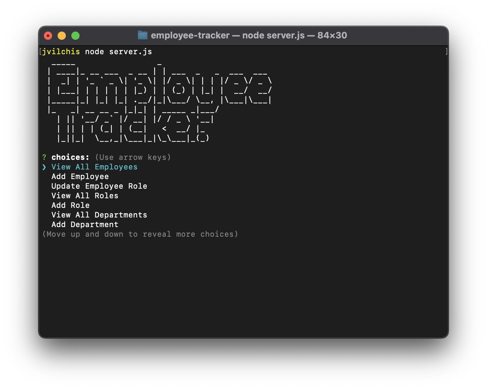

# Employee Tracker

 

 

## Description 

*The objective of this project:* 

This tracker will let you select, assign and manipulate roles to your desire employee. ## Table of contents
* [Installation](#installation)
* [Usage](#usage)
* [Contributing](#contributing)
* [Preview](#preview)
* [Questions](#questions)
## Installation
download or fork the repo. Make sure you have Node JS installed. Run the command npm install 
## Usage 

*Instructions and examples for use:*
This program can be used to maintain your employee database.
undefined
## contributing
  
*If you would like to contribute it, you can follow these guidelines for how to do so.*
Please fork the project and sumbit your PR.
## Preview
 
[video](https://drive.google.com/file/d/1h_WMpUuhCu0C_qSj6cQKxpsRDHnAqYOM/view)
## Questions

*If you have a concern or input abou the project, you can contact:*
 
Please contact Javier Vilchis via [Email](jvilchis@gmail.com)